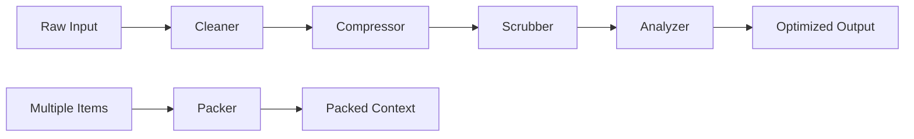

# Modules Overview

Prompt Refiner is organized into 5 specialized modules, each designed to handle a specific aspect of prompt optimization.

## The 5 Core Modules

### 1. Cleaner - Clean Dirty Data

The Cleaner module removes unwanted artifacts from your text.

**Operations:**

- **[StripHTML](../api-reference/cleaner.md#striphtml)** - Remove or convert HTML tags
- **[NormalizeWhitespace](../api-reference/cleaner.md#normalizewhitespace)** - Collapse excessive whitespace
- **[FixUnicode](../api-reference/cleaner.md#fixunicode)** - Remove problematic Unicode characters

**When to use:**

- Processing web-scraped content
- Cleaning user-generated text
- Normalizing text from various sources

[Learn more →](cleaner.md){ .md-button }

### 2. Compressor - Reduce Size

The Compressor module reduces token count while preserving meaning.

**Operations:**

- **[TruncateTokens](../api-reference/compressor.md#truncatetokens)** - Smart text truncation with sentence boundaries
- **[Deduplicate](../api-reference/compressor.md#deduplicate)** - Remove similar or duplicate content

**When to use:**

- Fitting content within context windows
- Optimizing RAG retrieval results
- Reducing API costs

[Learn more →](compressor.md){ .md-button }

### 3. Scrubber - Security & Privacy

The Scrubber module protects sensitive information.

**Operations:**

- **[RedactPII](../api-reference/scrubber.md#redactpii)** - Automatically redact personally identifiable information

**When to use:**

- Before sending data to external APIs
- Compliance with privacy regulations
- Protecting user data in logs

[Learn more →](scrubber.md){ .md-button }

### 4. Analyzer - Show Value

The Analyzer module tracks optimization impact.

**Operations:**

- **[CountTokens](../api-reference/analyzer.md#counttokens)** - Measure token savings and calculate ROI

**When to use:**

- Demonstrating cost savings
- A/B testing optimization strategies
- Monitoring optimization impact

[Learn more →](analyzer.md){ .md-button }

### 5. Packer - Context Budget Management

The Packer module manages context budgets with intelligent priority-based item selection.

**Operations:**

- **[ContextPacker](../api-reference/packer.md#contextpacker)** - Pack items into token budgets with priorities

**When to use:**

- RAG applications with multiple documents
- Chatbots with conversation history
- Managing context windows with size limits
- Combining system prompts, user input, and documents

[Learn more →](packer.md){ .md-button }

## Combining Modules

The real power comes from combining modules:

### Pipeline Example

```python
from prompt_refiner import (
    Refiner,
    StripHTML, NormalizeWhitespace,  # Cleaner
    TruncateTokens,                  # Compressor
    RedactPII,                       # Scrubber
    CountTokens                      # Analyzer
)

original_text = "Your text here..."
counter = CountTokens(original_text=original_text)

pipeline = (
    Refiner()
    # Clean first
    .pipe(StripHTML())
    .pipe(NormalizeWhitespace())
    # Then compress
    .pipe(TruncateTokens(max_tokens=1000))
    # Secure
    .pipe(RedactPII())
    # Analyze
    .pipe(counter)
)

result = pipeline.run(original_text)
print(counter.format_stats())
```

### Context Packer Example

```python
from prompt_refiner import (
    ContextPacker,
    PRIORITY_SYSTEM,
    PRIORITY_USER,
    PRIORITY_HIGH,
    StripHTML
)

# Manage RAG context budget
packer = ContextPacker(max_tokens=1000)

packer.add_item(
    "You are a helpful assistant.",
    priority=PRIORITY_SYSTEM
)

packer.add_item(
    "What is prompt-refiner?",
    priority=PRIORITY_USER
)

# Clean documents before packing
for doc in retrieved_docs:
    packer.add_item(
        doc.content,
        priority=PRIORITY_HIGH,
        refine_with=StripHTML()
    )

final_context = packer.pack()
```

## Module Relationships



## Best Practices

1. **Order matters**: Clean before compressing, compress before redacting
2. **Use Packer for RAG**: When managing multiple documents with priorities
3. **Test your pipeline**: Different inputs may need different operations
4. **Measure impact**: Use CountTokens to track savings
5. **Start simple**: Begin with one module and add more as needed
